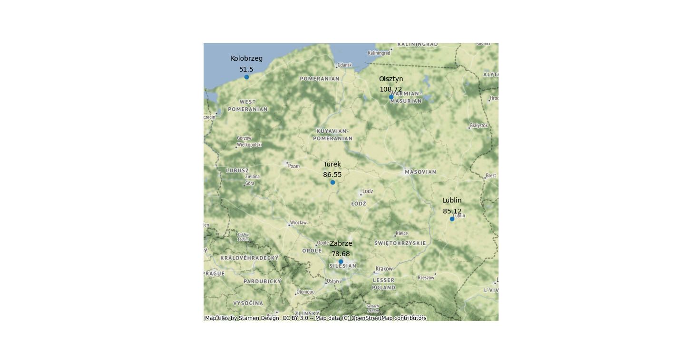

# warsztaty python<br>23.04.2023
#### >mateusz rydzik


Celem warsztatów było przedstawienie kilku przydatnych technik i umiejętności w Python, pozwalajacych na lepszą organizację struktury projektu, automatyzację pracy oraz wykorzystania API jako źródeł danych.

## 1. tematyka
Problemem, rozwiązywanym podczas warsztatów, było wykonanie wydruku składającego się z punktów, oraz nazwy miasta i wartości wybranego wskaźnika zanieczyszczeń powietrza dla prezentowanych punktów.

Dane do utworzenia punktów zawarto w pliku tekstowym `dane.txt`. Informacje odnośnie nazwy miasta oraz wartości indeksów zanieczyszczeń powietrza należało pozyskać, przy wykorzystaniu API usług kolejno HERE oraz OpenWeather.
## 2. rozwiązanie
```
├── .env
├── .envtemplate
├── .gitignore
├── Figure_1.png
├── dane.txt
├── funkcje
│   ├── __init__.py
│   ├── annotations.py
│   └── get.py
└── main.py
```

### `main.py`

Plik `dane.txt` złożony jest z pięciu wierszy, oddzielonych nową linią. Każdy wiersz posiada dwie wartości numeryczne, oddzielone przecinkiem. Reprezentują one wartości X i Y. Wartości wczytano przy pomocy funkcji `open()`, dzieląc każdy z wierszy na dwie współrzędne w miejscu występowania przecinka. Wartości zostały zapisane w zagnieżdżonych listach
 
Dane z API HERE oraz OpenWeather pozyskano ze skontruowanych funkcji. Ich wyniki zapisano do osobnych list, Przedstawiono różnice między wypełnieniem listy wartościami przy pomocy list comprehension oraz pętli for.
```
#dodawanie wartosci do listy: dwa sposoby
#1. list comprehension
city_names = [city_names(coord) for coord in coordinates]

#2. petla
poll_data = []
for coord in coordinates:
    pol_data = pollution_data(coord, 'pm10')
    poll_data.append(pol_data)
```

Utworzone listy połączono w jedną ramkę danych, którą następnie przekształcono w przestrzenny obiekt GeoDatarame. Zbiorowi nadano układ współrzędnych EPSG:4326, który następnie zmieniono na EPSG:3857 w celu prezentacji lepszej jakości mapy podkładowej.

Dla wydruku, ustawiono zasięg identyczny jak dla zasięgu Polski. Usunięto z wydruku osie oraz obramowanie, dodano adnotacje przy wykorzystaniu skonstruowanej funkcji oraz dodano mapę podkładową.

Przykładowy wydruk wynikowy: 


### `funkcje/get.py`

Skrypt zawiera dwie funkcje, `city_names` oraz `pollution_data`. Odpowiadają one za pozyskanie wartości z API HERE i OpenWeather. Obie funkcje przyjmują argument reprezentujący listę z parą wartości X i Y. Dodatkowo, `pollution_data` przyjmuje dodatkowy argument, służący do wyboru indeksu zanieczyszczeń. 

Skrypt pozyskuje klucze do API ze zmiennych środowiskowych, zdefiniowanych w pliku `.env`. Wymagane jest stworzenie własnego pliku `.env`, bazującego na konstrukcji pliku `.envtemplate`.

Więcej informacji odnośnie pozyskiwania danych z API HERE i OpenWeather udostępniono w ich dokumentacjach
https://developer.here.com/documentation/geocoding-search-api/dev_guide/topics/endpoint-reverse-geocode-brief.html

https://openweathermap.org/api/air-pollution

### `funkcje/annotations.py`
Skrypt zawiera jedną funkcję, pozwalającą na dodawanie etykiet do punktów. Przyjmuje ona kilka argumentów dotyczących obiektu wydruku, reprezentujących niezbędne obiekty oraz dodatkowe zmienne.
